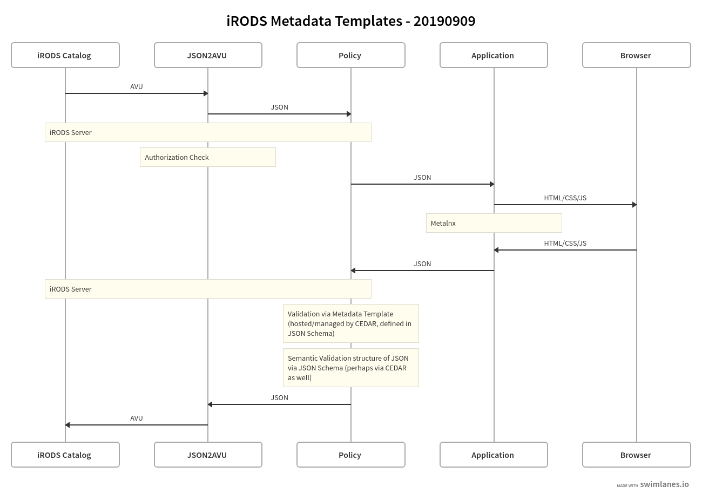

## Metadata Templates Working Group HackDay Minutes

Tuesday, 2019/08/20

9:00 am EDT

## Attendees:

Terrell Russell, Ton Smeele, Chris Smeele, Kory Draughn, Alan King, Paul van Schayck, Jason Coposky, Daniel Theunissen, Deep Patel, Mike Conway, Ilari Korhonen, Dave Fellinger

## Minutes

### System Narrative (so far)

Metadata Templates (MT) describes a set of standards and services at a generic level that can serve typical iRODS deployments. MT has the following primary goals:
 - Serve as a structure for grouping, validating, and adding semantic meaning to raw iRODS AVU metadata
 - Provide services that can enhance UI for data display and metadata curation
 - Provide services that can enhance search through structured search interfaces and builders for virtual collection queries
 - Assist in linking vocabularies and ontologies to iRODS catalog objects

MTs describe a schema for a particular purpose (example: Dublin Core, NCI Common Data Elements, DataCite). These schema are stored in a common location. JSON Schema is proposed as the format for MTs.

MTs are bound to an iRODS logical path (Collection, Data Object, Resource, Zone, User…) which can require or suggest use of a template. (Inherited by children? Override at child level?) by a curator or collection administrator.

Data curation through UI or other means creates an MT instance that is serialized as AVU metadata. MT and serialized AVUs are resolvable bi-directionally (an AVU can describe what template it is from, the MT services can resolve a template instance given an iRODS logical path).

Ideally MTs are an optional add-in (maybe another form of Python rule engine, like the MT rule engine? Or other packaging form?). There should be an illustrative set of templates that are useful out of the box.

Relating MT to ongoing indexing work is an interesting way of gaining critical mass.

### Main Components, Roles, Responsibilities

1. Primary Services as Python iRODS Rule Engine components
   - Schema Repo/Resolution/CRUD
   - Two-way instance binding
     - Apply template to target iRODS object
     - Resolve from AVU to template instance
     - Get template instances associated with path
     - On-demand validation/exception reporting
   - Template Binding
     - Bind template to path and other CRUD
2. Vocabulary plugin service (This is Mike shoving this use case under this umbrella)
   - Add ability to pull in SKOS vocabulary as AVU values
     - Label search
     - Nav broader, narrower, related
     - Apply vocab URI as AVU in a template
3. Swagger API wrapping primary services
4. UI affordances in Metalnx for curation

### HackDay Notes

Attempt to clarify last meeting’s table with some separation of layers/code...

-| Functionality | Implementation | Implementor(s)
---- | ---- | ---- | ----
LAYER 5 | HTML/CSS/JS | internet | internet
CODE 4 | Multiple UIs / Utilities handling the translation/presentation | Yoda, Metalnx | Yoda, NIEHS
LAYER 4 | JSON | JSON | JSON Spec
CODE 3 | Tools/API for translation from template to AVUs and back | JSON<->AVU | DataHub+, Yoda
LAYER 3 | AVU | AVU | iRODS Consortium
CODE 2 | Tools for managing the AVUs with relation to the templates | rules/policy | DataHub+, Yoda
LAYER 2 | Implementation of a Metadata Template | .irods file or stored at CEDAR for now | iRODS Consortium
CODE 1 | Tools for template creation / curation / versioning / management | CEDAR | CEDAR
LAYER 1 | Definition / Representation of a Template | JSON Schema | JSON Schema Organization

This table is incorrect - it should not be linear.  We drew on the board and will make a prettier version soon.  Looks like an A, rather than an I.

TODO: New API endpoint - Multi-avu save into the catalog, within a transaction.    Need to define the schema for this payload (probably just an array of operations on AVU objects).  The application code would send an ordered array… probably first with removes, then adds... and not worry about other non-included items.   Would allow multiple namespaced (json_root -> json_namespace) templates to be applied to the same data object / collection.
- https://github.com/MaastrichtUniversity/irods_avu_json-ruleset/blob/master/rules/core.py#L66
  - https://github.com/irods/irods/issues/4484

Example...
  - Array of [{Operation (add/remove), a, v, u}]
    - Possible silent/ignore of a delete on a thing that doesn’t exist
    - Need to consider wildcards - will require fewer calls and less client/app code

This will allow the rules/policy within the metadata conversion process to provide a payload and remove the need for the global variable
 - https://github.com/MaastrichtUniversity/irods_avu_json-ruleset/blob/master/rules/core.py#L11

JSON Schema should be a URI

The `special` $id AVU:
 - Attribute → $id
 - Value → URI
 - Unit → JSON_namespace

URI is either
 - dereferenced https (e.g. CEDAR) or
 - "i:/" … "irods:///logical/path/within/iRODS"

Participating AVU:
 - A → key
 - V → value
 - U → JSON_namespace + object_id + type + array index

Unit Format/Schema:
 - https://github.com/MaastrichtUniversity/irods_avu_json/blob/master/jsonavu/avu2json.py#L3
 - `'^[a-zA-Z0-9_]+_([0-9]+)_([osbanze])((?<=o)[0-9]+)?((?:#[0-9]+?)*)'`

Example: 

```
irods@irods:/rules/python$ imeta ls -C /nlmumc/projects/P000000005
AVUs defined for collection /nlmumc/projects/P000000005:
attribute: age
value: 21
units: root_0_n

attribute: $id
value: https://api.myjson.com/bins/17vejk
units: root

attribute: lastName
value: Doe
units: root_0_s

attribute: firstName
value: John
units: root_0_s
```




https://swimlanes.io/u/8pLI9reaL
```
title: iRODS Metadata Templates - 20190909
iRODS Catalog -> JSON2AVU: AVU
JSON2AVU -> Policy: JSON
note iRODS Catalog, Policy: iRODS Server
note JSON2AVU, JSON2AVU: Authorization Check
Policy -> Application: JSON
Application -> Browser: HTML/CSS/JS
note Application, Application: Metalnx
Browser -> Application: HTML/CSS/JS
Application -> Policy: JSON
note iRODS Catalog, Policy: iRODS Server
note Policy, Policy: Validation via Metadata Template (hosted/managed by CEDAR, defined in JSON Schema)
note Policy, Policy: Semantic Validation structure of JSON via JSON Schema (perhaps via CEDAR as well)
Policy -> JSON2AVU: JSON
JSON2AVU -> iRODS Catalog: AVU
```

First draft of batch_apply_metadata_operations()
 - https://github.com/korydraughn/irods/tree/parallel_transfer_engine.m/plugins/api/src

Unit test
 - https://github.com/korydraughn/irods/blob/parallel_transfer_engine.m/unit_tests/src/test_rc_batch_apply_metadata_operations.cpp


Example of an external-to-iRODS located JSONschema
 - https://yoda.uu.nl/schemas/default-0/metadata.json

Such a schema can be used in the policy swimlane to validate the syntax structure of a JSON representation before it is applied as set of AVU operations.

